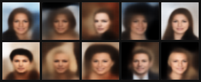

# Variational Autoencoder (VAE) on CelebA

> A Convolutional VAE trained on [CelebA](http://mmlab.ie.cuhk.edu.hk/projects/CelebA.html) to learn and generate face images — implemented from scratch in PyTorch.

---

## Generated Samples

10 faces sampled by drawing $z \sim \mathcal{N}(0, I)$ and passing through the decoder — no encoder involved at inference time.



> [!NOTE]
> **Disclaimer:** This model was trained for only **30 epochs** as a proof of concept. The generated faces may appear blurry or lack fine detail — this is expected behaviour for a vanilla convolutional VAE at low epoch counts. If you want sharper, more realistic results consider:
> - **Increasing epochs** (100–200+) to let the model converge more fully
> - **Tuning the KL weight** (β-VAE: `loss = recon + β * kl` with β < 1) to prioritise reconstruction quality
> - **Switching to a stronger architecture** such as a [VQ-VAE](https://arxiv.org/abs/1711.00937) or a [VAE-GAN](https://arxiv.org/abs/1512.09300) for perceptually sharper outputs

---

## Table of Contents

- [Generated Samples](#generated-samples)
- [Theoretical Foundation](#theoretical-foundation)
  - [The Manifold Hypothesis](#1-the-manifold-hypothesis)
  - [The Reparameterization Trick](#2-the-reparameterization-trick)
  - [The ELBO Loss](#3-the-evidence-lower-bound-elbo-loss)
- [Architecture](#architecture)
- [Codebase Overview](#codebase-implementation)
- [Running the Project](#running-the-project)
- [References](#references)

---


## Theoretical Foundation

> 📓 **Full derivations, recall exercises, and diagrams** are in the companion notes:
> [`Variational Autoencoders (VAEs).md`](./Variational%20Autoencoders%20%28VAEs%29.md)

### 1. The Manifold Hypothesis

Most naturally occurring high-dimensional datasets (like the $64 \times 64 \times 3$ images in this repo) lie on a **low-dimensional manifold**. By compressing images into a compact 200-dimensional latent space ($d_z \ll d_x$), the VAE forces the network to learn the most essential underlying features — pose, lighting, identity. The KL divergence regularizer ensures this latent space is **continuous and smooth**, allowing the decoder to interpolate and generate new, valid images.

> 📖 **Extra reading:** [Manifold Hypothesis → Notes](./Variational%20Autoencoders%20%28VAEs%29.md#manifold-hypothesis)

---

### 2. The Reparameterization Trick

Standard neural networks are deterministic. VAEs introduce a probabilistic bottleneck where we sample $z \sim \mathcal{N}(\mu, \sigma^2)$. Because random sampling is not differentiable, we use the **reparameterization trick** to keep gradients flowing:

$$z = \mu + \sigma \cdot \varepsilon, \qquad \varepsilon \sim \mathcal{N}(0, 1)$$

This isolates stochasticity into the external noise $\varepsilon$, allowing gradients to flow deterministically through $\mu$ and $\sigma$ during backpropagation.

> 📖 **Extra reading:** [Differentiability Problem → Notes](./Variational%20Autoencoders%20%28VAEs%29.md#the-differentiability-problem) · [Reparameterization Trick → Notes](./Variational%20Autoencoders%20%28VAEs%29.md#the-reparameterization-trick) · [Why Log Variance → Notes](./Variational%20Autoencoders%20%28VAEs%29.md#why-log-variance)

---

### 3. The Evidence Lower Bound (ELBO) Loss

Training maximises the **ELBO**, which balances two competing objectives:

| Term | Role | Formula |
|---|---|---|
| **Reconstruction Loss** | Fidelity — how accurately is the input reproduced? | Binary Cross-Entropy (BCE), since pixels ∈ [0, 1] |
| **KL Divergence** | Regularizer — penalises the latent posterior for drifting from the prior $\mathcal{N}(0, I)$ | $-\frac{1}{2}\sum(1 + \log\sigma^2 - \mu^2 - \sigma^2)$ |

$$\mathcal{L}_{\text{total}} = \mathcal{L}_{\text{recon}} + \mathcal{L}_{\text{KL}}$$

> 📖 **Extra reading:** [Full ELBO Derivation → Notes](./Variational%20Autoencoders%20%28VAEs%29.md#elbo-derivation) · [KL Divergence Closed Form → Notes](./Variational%20Autoencoders%20%28VAEs%29.md#kl-divergence--closed-form) · [Reconstruction Loss → Notes](./Variational%20Autoencoders%20%28VAEs%29.md#reconstruction-loss)

---

## Architecture

The VAE consists of a **probabilistic encoder** and a **mirrored decoder**:

```
Input (3×64×64)
    │
    ▼
[Encoder — Conv2d ×5 → halve spatial dims]
    │
    ├──► μ  (200-dim)
    └──► log σ²  (200-dim)
              │
              ▼  z = μ + σ·ε   ← reparameterization
              │
    ▼
[Decoder — Linear projection → ConvTranspose2d ×5 → Sigmoid]
    │
    ▼
Output (3×64×64)  ∈ [0, 1]
```

| Component | AE | VAE |
|---|---|---|
| Encoder output | $z$ — single vector | $\boldsymbol{\mu}$, $\log\boldsymbol{\sigma}^2$ — two vectors |
| Latent sample | Deterministic | $z = \boldsymbol{\mu} + \boldsymbol{\sigma} \odot \varepsilon,\ \varepsilon \sim \mathcal{N}(0,I)$ |
| Losses | Reconstruction only | Reconstruction + KL |
| Generation | ✗ Fails (unstructured space) | ✓ Sample $z \sim \mathcal{N}(0,I)$ → decoder |

> 📖 **Extra reading:** [AE vs VAE Architecture → Notes](./Variational%20Autoencoders%20%28VAEs%29.md#architecture) · [Why Normal Prior? → Notes](./Variational%20Autoencoders%20%28VAEs%29.md#why-normal-for-the-latent-space)

---

## Codebase Implementation

The implementation is fully modularized:

```
vae/
├── modeling.py   # VAE architecture (Encoder, Decoder, reparameterize)
├── data.py       # CelebA data pipeline (loaders for train/valid/test)
├── train.py      # Training loop + ELBO loss
├── main.py       # Entry point
└── generate.py   # Standalone image generation script
```

### `modeling.py` — Architecture

Contains the `VAE` class built with `nn.Module`:

- **Encoder**: `Conv2d` layers (`kernel_size=4`, `stride=2`, `padding=1`) progressively halve spatial dims from $64 \times 64$ down to $2 \times 2 \times 512$. Two `Linear` heads project to $\mu$ and $\log\sigma^2$.
- **Latent Space**: 200-dimensional. Sampled via `reparameterize()` during training; deterministic ($z = \mu$) at inference.
- **Decoder**: An `Unflatten` layer reshapes the latent vector back to spatial dims, followed by `ConvTranspose2d` layers that double spatial dims back to $64 \times 64$. Ends with `Sigmoid` to output pixel values $\in [0, 1]$.

> ⚠️ **Common bug:** The decoder receives a 1D latent vector but `ConvTranspose2d` expects a 4D tensor — a linear projection + reshape layer (`decoder_input`) is required between the latent code and the first `ConvTranspose2d`. See [Convolutional VAE → Notes](./Variational%20Autoencoders%20%28VAEs%29.md#convolutional-vae) for the full annotated implementation.

### `data.py` — Data Pipeline

Handles loading and preprocessing **CelebA** via `torchvision.datasets`. Images pass through `CelebVAETransform` (resize to $64 \times 64$, `ToTensor`). Returns a `NamedTuple` of PyTorch `DataLoader` objects for `train`, `valid`, and `test` splits.

### `train.py` & `main.py` — Execution

`train.py` orchestrates the training loop with `AdamW` and automatic GPU placement:

- **Training**: Iterates over batches, computes ELBO, updates weights.
- **Generation**: After training, `generate_nsamples` tests generative capability by sampling $\varepsilon \sim \mathcal{N}(0, 1)$ directly from the prior, passing through the decoder, and saving synthetic faces as `.png` files to `samples/`.

> 📖 **Reference implementation:** [Linear VAE → Notes](./Variational%20Autoencoders%20%28VAEs%29.md#linear-vae) · [Convolutional VAE → Notes](./Variational%20Autoencoders%20%28VAEs%29.md#convolutional-vae)

---

## Running the Project

To start training the VAE and auto-generate samples at the end of training:

```bash
uv run main.py
```

Generated face images will be saved to the `samples/` directory.

---

## References

- Kingma & Welling, *Auto-Encoding Variational Bayes*, 2013 — [arXiv:1312.6114](https://arxiv.org/abs/1312.6114)
- [Variational Autoencoders from Scratch (YouTube)](https://www.youtube.com/watch?v=4WRvGMX4Sik)
- [Gumbel-Softmax — discrete reparameterization](https://sassafras13.github.io/GumbelSoftmax/)
- 📓 [Personal Study Notes](./Variational%20Autoencoders%20%28VAEs%29.md) — full ELBO derivation, KL closed form, recall exercises
